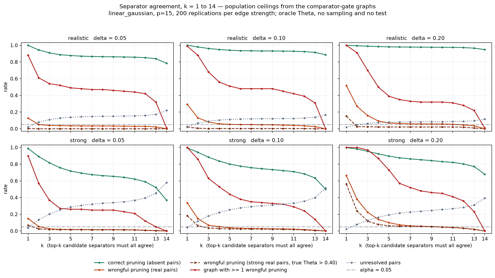

# Separator-agreement feasibility gate — the existential quantifier fails, unanimity passes

The [comparator gate](../comparator-gate/README.md) established that choosing the separator
which *minimises* the quantity later tested drives strong true edges below `delta` in the
population. The [k = 1,2,3,5 diagnostic](../policy3-agreement-diagnostic/README.md) showed
that requiring several candidates to agree shrinks that failure without removing it. This
sweep runs the same rule over the **entire** candidate pool and asks the feasibility question
directly:

> Is there any `k` that keeps useful pruning while making whole-network wrongful deletion
> acceptably rare?

**Answer: yes, at exactly one value — `k = 14`, the whole pool. No `k` from 1 to 13 qualifies
at every resolution.** Since 14 is the pool size rather than a tuning constant, the finding is
not "use k = 14"; it is that **`E_delta` must be defined by universal quantification over the
candidate pool, not existential quantification over it**. Specification section 10's `exists S`
fails this gate. `for all S` passes it, at the population level.

## What was run

Oracle only, no new simulation. Each graph is rebuilt from the `replicate` seed already
recorded in `comparator-gate/comparator_gate_results.parquet`; every quantity is exact
population `Theta` for the `linear_gaussian` family, with no sampling, no estimator and no
test. 200 replications per edge strength, `p = 15`, 10,500 pairs per cell.

The candidate pool is the empty set plus each of the other 13 variables — the pool the gate
itself ranked over, since `benchmark_project_spec` sets `max_neighbors = p - 1`. `k = 14` is
therefore unanimity over the searched family, not a widened search.

Three states, mirroring `certify_pairs`, which requires **both** directions to agree before it
returns any verdict. For one candidate `S`, write `separating` for
`max(theta_i, theta_j) <= delta` and `adjacency evidence` for `min(theta_i, theta_j) > delta`.
Then at a given `k`: certified nonedge when all of the top `k` are separating, candidate
adjacency when all of the top `k` carry adjacency evidence, unresolved otherwise.

**Every rate is a ceiling.** It describes infinite data. A finite-sample rule must also clear a
calibrated test, which is strictly more conservative, so real rates fall on both sides. These
levels are not comparable to the gate's observed rates.

## Reading the table

* **correct prune** — genuinely absent pairs (non-adjacent, plus adjacent pairs negligible at
  this `delta`) declared a nonedge. Denominator 8,963-9,514 per cell.
* **wrongful prune** — real pairs at this `delta` declared a nonedge. Denominator 986-1,735.
* **wrongful, strong** — the same, restricted to real pairs whose true `Theta` given their own
  parents exceeds 0.40 or 0.60. The `realistic` generator produces no edge above 0.60 — a
  degree-3 node splitting 30-60% of its variance cannot — so that column is empty there and
  the 0.40 column is the usable one in both regimes.
* **graph has >= 1 wrongful** — the familywise quantity: share of the 200 graphs containing at
  least one wrongful deletion anywhere.
* **unresolved** — share of all 105 pairs left in the third state.

## Full sweep

| edge strength | delta | k | correct prune | wrongful prune | wrongful, strong (>0.40) | wrongful, strong (>0.60) | graph has >=1 wrongful | unresolved |
|---|---|---|---|---|---|---|---|---|
| realistic | 0.05 | 1 | 0.999 | 0.127 | 0.003 | -- | 0.880 | 0.020 |
| realistic | 0.05 | 2 | 0.944 | 0.051 | 0.000 | -- | 0.610 | 0.080 |
| realistic | 0.05 | 3 | 0.910 | 0.040 | 0.000 | -- | 0.540 | 0.110 |
| realistic | 0.05 | 4 | 0.887 | 0.037 | 0.000 | -- | 0.520 | 0.129 |
| realistic | 0.05 | 5 | 0.877 | 0.035 | 0.000 | -- | 0.490 | 0.138 |
| realistic | 0.05 | 6 | 0.870 | 0.035 | 0.000 | -- | 0.480 | 0.144 |
| realistic | 0.05 | 7 | 0.865 | 0.034 | 0.000 | -- | 0.470 | 0.148 |
| realistic | 0.05 | 8 | 0.863 | 0.033 | 0.000 | -- | 0.470 | 0.149 |
| realistic | 0.05 | 9 | 0.862 | 0.033 | 0.000 | -- | 0.460 | 0.151 |
| realistic | 0.05 | 10 | 0.860 | 0.031 | 0.000 | -- | 0.450 | 0.153 |
| realistic | 0.05 | 11 | 0.858 | 0.030 | 0.000 | -- | 0.440 | 0.155 |
| realistic | 0.05 | 12 | 0.851 | 0.029 | 0.000 | -- | 0.420 | 0.160 |
| realistic | 0.05 | 13 | 0.839 | 0.022 | 0.000 | -- | 0.320 | 0.171 |
| realistic | 0.05 | 14 | 0.785 | 0.001 | 0.000 | -- | 0.010 | 0.221 |
| realistic | 0.10 | 1 | 1.000 | 0.293 | 0.021 | -- | 0.990 | 0.026 |
| realistic | 0.10 | 2 | 0.980 | 0.131 | 0.006 | -- | 0.880 | 0.067 |
| realistic | 0.10 | 3 | 0.962 | 0.082 | 0.003 | -- | 0.680 | 0.090 |
| realistic | 0.10 | 4 | 0.949 | 0.060 | 0.003 | -- | 0.560 | 0.104 |
| realistic | 0.10 | 5 | 0.940 | 0.052 | 0.003 | -- | 0.510 | 0.112 |
| realistic | 0.10 | 6 | 0.935 | 0.051 | 0.003 | -- | 0.480 | 0.117 |
| realistic | 0.10 | 7 | 0.934 | 0.050 | 0.003 | -- | 0.480 | 0.119 |
| realistic | 0.10 | 8 | 0.932 | 0.049 | 0.003 | -- | 0.480 | 0.120 |
| realistic | 0.10 | 9 | 0.931 | 0.047 | 0.003 | -- | 0.480 | 0.121 |
| realistic | 0.10 | 10 | 0.930 | 0.044 | 0.003 | -- | 0.450 | 0.122 |
| realistic | 0.10 | 11 | 0.928 | 0.041 | 0.003 | -- | 0.420 | 0.124 |
| realistic | 0.10 | 12 | 0.924 | 0.035 | 0.003 | -- | 0.390 | 0.129 |
| realistic | 0.10 | 13 | 0.914 | 0.026 | 0.000 | -- | 0.310 | 0.139 |
| realistic | 0.10 | 14 | 0.887 | 0.000 | 0.000 | -- | 0.000 | 0.166 |
| realistic | 0.20 | 1 | 1.000 | 0.518 | 0.152 | -- | 1.000 | 0.020 |
| realistic | 0.20 | 2 | 0.994 | 0.270 | 0.024 | -- | 0.910 | 0.048 |
| realistic | 0.20 | 3 | 0.989 | 0.158 | 0.024 | -- | 0.700 | 0.063 |
| realistic | 0.20 | 4 | 0.984 | 0.093 | 0.021 | -- | 0.500 | 0.073 |
| realistic | 0.20 | 5 | 0.981 | 0.069 | 0.021 | -- | 0.390 | 0.079 |
| realistic | 0.20 | 6 | 0.979 | 0.063 | 0.021 | -- | 0.350 | 0.081 |
| realistic | 0.20 | 7 | 0.978 | 0.059 | 0.021 | -- | 0.330 | 0.082 |
| realistic | 0.20 | 8 | 0.977 | 0.058 | 0.021 | -- | 0.320 | 0.083 |
| realistic | 0.20 | 9 | 0.977 | 0.057 | 0.021 | -- | 0.320 | 0.084 |
| realistic | 0.20 | 10 | 0.976 | 0.057 | 0.021 | -- | 0.320 | 0.085 |
| realistic | 0.20 | 11 | 0.975 | 0.054 | 0.021 | -- | 0.310 | 0.086 |
| realistic | 0.20 | 12 | 0.972 | 0.046 | 0.018 | -- | 0.280 | 0.089 |
| realistic | 0.20 | 13 | 0.965 | 0.035 | 0.009 | -- | 0.220 | 0.096 |
| realistic | 0.20 | 14 | 0.948 | 0.001 | 0.000 | -- | 0.010 | 0.115 |
| strong | 0.05 | 1 | 0.988 | 0.150 | 0.069 | 0.036 | 0.900 | 0.037 |
| strong | 0.05 | 2 | 0.891 | 0.053 | 0.024 | 0.004 | 0.570 | 0.134 |
| strong | 0.05 | 3 | 0.817 | 0.026 | 0.017 | 0.002 | 0.370 | 0.201 |
| strong | 0.05 | 4 | 0.757 | 0.019 | 0.016 | 0.002 | 0.270 | 0.252 |
| strong | 0.05 | 5 | 0.717 | 0.018 | 0.016 | 0.002 | 0.260 | 0.286 |
| strong | 0.05 | 6 | 0.693 | 0.017 | 0.016 | 0.002 | 0.260 | 0.306 |
| strong | 0.05 | 7 | 0.675 | 0.016 | 0.014 | 0.002 | 0.250 | 0.321 |
| strong | 0.05 | 8 | 0.663 | 0.016 | 0.014 | 0.002 | 0.250 | 0.332 |
| strong | 0.05 | 9 | 0.654 | 0.016 | 0.014 | 0.002 | 0.250 | 0.339 |
| strong | 0.05 | 10 | 0.643 | 0.014 | 0.014 | 0.002 | 0.230 | 0.349 |
| strong | 0.05 | 11 | 0.622 | 0.013 | 0.013 | 0.002 | 0.210 | 0.366 |
| strong | 0.05 | 12 | 0.589 | 0.007 | 0.008 | 0.000 | 0.120 | 0.394 |
| strong | 0.05 | 13 | 0.521 | 0.003 | 0.004 | 0.000 | 0.050 | 0.452 |
| strong | 0.05 | 14 | 0.368 | 0.000 | 0.000 | 0.000 | 0.000 | 0.580 |
| strong | 0.10 | 1 | 0.995 | 0.337 | 0.183 | 0.102 | 1.000 | 0.042 |
| strong | 0.10 | 2 | 0.942 | 0.148 | 0.063 | 0.026 | 0.860 | 0.118 |
| strong | 0.10 | 3 | 0.883 | 0.070 | 0.035 | 0.010 | 0.630 | 0.180 |
| strong | 0.10 | 4 | 0.837 | 0.051 | 0.029 | 0.006 | 0.530 | 0.222 |
| strong | 0.10 | 5 | 0.801 | 0.038 | 0.024 | 0.004 | 0.440 | 0.254 |
| strong | 0.10 | 6 | 0.776 | 0.031 | 0.023 | 0.004 | 0.380 | 0.276 |
| strong | 0.10 | 7 | 0.758 | 0.030 | 0.023 | 0.004 | 0.350 | 0.292 |
| strong | 0.10 | 8 | 0.746 | 0.028 | 0.022 | 0.004 | 0.340 | 0.302 |
| strong | 0.10 | 9 | 0.735 | 0.025 | 0.021 | 0.004 | 0.330 | 0.312 |
| strong | 0.10 | 10 | 0.723 | 0.024 | 0.019 | 0.004 | 0.320 | 0.322 |
| strong | 0.10 | 11 | 0.711 | 0.022 | 0.017 | 0.004 | 0.290 | 0.333 |
| strong | 0.10 | 12 | 0.684 | 0.017 | 0.013 | 0.002 | 0.240 | 0.356 |
| strong | 0.10 | 13 | 0.635 | 0.009 | 0.005 | 0.000 | 0.140 | 0.399 |
| strong | 0.10 | 14 | 0.499 | 0.000 | 0.000 | 0.000 | 0.000 | 0.514 |
| strong | 0.20 | 1 | 0.999 | 0.664 | 0.562 | 0.460 | 1.000 | 0.022 |
| strong | 0.20 | 2 | 0.982 | 0.380 | 0.241 | 0.147 | 1.000 | 0.079 |
| strong | 0.20 | 3 | 0.954 | 0.224 | 0.117 | 0.056 | 0.970 | 0.126 |
| strong | 0.20 | 4 | 0.924 | 0.139 | 0.077 | 0.026 | 0.870 | 0.164 |
| strong | 0.20 | 5 | 0.897 | 0.100 | 0.062 | 0.022 | 0.730 | 0.193 |
| strong | 0.20 | 6 | 0.876 | 0.074 | 0.057 | 0.018 | 0.570 | 0.214 |
| strong | 0.20 | 7 | 0.863 | 0.062 | 0.056 | 0.018 | 0.520 | 0.227 |
| strong | 0.20 | 8 | 0.853 | 0.056 | 0.056 | 0.018 | 0.480 | 0.236 |
| strong | 0.20 | 9 | 0.842 | 0.052 | 0.053 | 0.016 | 0.460 | 0.246 |
| strong | 0.20 | 10 | 0.831 | 0.047 | 0.047 | 0.014 | 0.450 | 0.257 |
| strong | 0.20 | 11 | 0.821 | 0.041 | 0.041 | 0.012 | 0.410 | 0.266 |
| strong | 0.20 | 12 | 0.802 | 0.033 | 0.033 | 0.008 | 0.360 | 0.283 |
| strong | 0.20 | 13 | 0.772 | 0.020 | 0.018 | 0.004 | 0.230 | 0.311 |
| strong | 0.20 | 14 | 0.678 | 0.000 | 0.000 | 0.000 | 0.000 | 0.394 |



## The decision

Take `0.05` as the familywise bar, since that is what the certificate claims.

| k | cells (of 6) meeting the bar | worst familywise |
|---|---|---|
| 1 | 0 | 1.000 |
| 5 | 0 | 0.730 |
| 12 | 0 | 0.420 |
| 13 | 1 | 0.320 |
| **14** | **6** | **0.010** |

The approach to the bar is not gradual. Between `k = 13` and `k = 14` the familywise rate
falls from 0.22-0.32 to 0.00-0.01 in five of six cells, while correct pruning gives up only
0.02-0.15. Every rule short of unanimity still lets a pair select the conditioning sets that
flatter it; unanimity removes the selection entirely, and with it the population failure.

At `k = 14`:

| cell | correct prune | wrongful prune | wrongful, strong (>0.40) | familywise | unresolved |
|---|---|---|---|---|---|
| realistic, delta 0.05 | 0.785 | 0.001 | 0.000 | 0.010 | 0.221 |
| realistic, delta 0.10 | 0.887 | 0.000 | 0.000 | 0.000 | 0.166 |
| realistic, delta 0.20 | 0.948 | 0.001 | 0.000 | 0.010 | 0.115 |
| strong, delta 0.05 | 0.368 | 0.000 | 0.000 | 0.000 | 0.580 |
| strong, delta 0.10 | 0.499 | 0.000 | 0.000 | 0.000 | 0.514 |
| strong, delta 0.20 | 0.678 | 0.000 | 0.000 | 0.000 | 0.394 |

Wrongful deletion of strong real pairs — the failure the comparator gate exposed, at 0.460 in
the worst cell under the current policy — goes to exactly zero everywhere.

## A hypothesis this refuted

Unanimity includes the empty set, and requiring *that* to separate is a marginal condition. So
the result could have been the separator search doing nothing and a marginal association screen
doing all the work. It is not (`unanimity_decomposition.csv`):

| edge strength | delta | all 14 | 13 singletons only | empty set only |
|---|---|---|---|---|
| realistic | 0.20 | 0.948 / 0.001 | 0.948 / 0.001 | 0.978 / 0.058 |
| strong | 0.20 | 0.678 / 0.000 | 0.678 / 0.000 | 0.842 / 0.061 |
| strong | 0.05 | 0.368 / 0.000 | 0.368 / 0.000 | 0.660 / 0.016 |

*(correct prune / wrongful prune)*

Dropping the empty set changes nothing to three decimals in any of the six cells, so it is not
the binding candidate. The marginal screen alone is a materially different and worse-controlled
rule — it prunes more and deletes 1.6-6.1% of real pairs, against 0.0-0.1% for unanimity. The
conditional structure is doing the work.

## Recommendation

**Adopt universal quantification over the candidate pool as the definition of a certified
nonedge, in a new, separately calibrated multi-separator ResolutionGraph design.** Recommended
range: unanimity only. `k = 13` of 14 is not a fallback — it misses the bar in five of six
cells, and the sweep gives no evidence for any intermediate value.

This is a recommendation to *design and calibrate*, not to adopt. Nothing here licenses a
certificate, and no existing calibration transfers to it.

### What it changes

* **Section 10** becomes `for all S in the pool` rather than `exists S`. `E_delta` is then
  monotone *increasing* in the pool: adding a candidate can only remove nonedges, the reverse
  of the current relation, so a larger pool becomes conservative rather than adversarial.
* **Section 15.4 becomes unnecessary.** With no selection there is no ranking, so the policy
  the gate falsified is deleted rather than replaced. `rank_separators` is retired; only the
  pool construction in `screen_neighbors` remains.
* **The selection split's purpose narrows.** It exists to keep separator choice out of the
  inference data. With nothing chosen, that rationale goes; whether the split is still needed
  is an open design question, and dropping it would return ~20% of the rows to inference.

### What it costs

* **Unresolved pairs**: 0.115 to 0.580 of all pairs, worst where `delta` is fine and edges are
  strong. Over half the network is unresolved in the `strong` / `delta = 0.05` cell, and
  correct pruning there is only 0.368 even with infinite data. That cell is close to
  uninformative and should be treated as outside the operating region.
* **Compute**: 14 separators x 2 directions x 105 pairs = 2,940 cross-fitted VIMP fits per
  analysis against 210 today, a 14x increase before any resampling.
* **A wholly new calibration.** The decision becomes the maximum of `2k = 28` dependent
  one-sided tests per pair, Holm-adjusted across ~105 pairs. That is a different quantity from
  the maximum of 2 that the packaged profiles were validated against. **The existing profiles
  do not transfer.** A new Phase-0 calibration is a precondition, not a follow-up.

### The open question this cannot answer

Every number here is a population ceiling. Requiring 28 one-sided tests to pass simultaneously
is a far harsher intersection-union than the current 2, and finite-sample power will fall well
below these correct-prune rates — possibly to near zero at `n = 375`. **Whether unanimity
retains useful power at a realistic sample size is unknown and is the next gate.** It is the
cheapest decisive experiment available: the estimator, the DGP, the graphs and the scoring all
already exist.

## Limitations

* **`linear_gaussian` only.** The exact covariance makes the oracle free; `additive_nonlinear`
  needs Monte Carlo `Theta` per candidate set, orders of magnitude more compute.
* **Ceiling, not a prediction.** No statement here bounds any finite-sample rate.
* **Size-1 separators**, matching the calibrated configuration and the gate. Under unanimity a
  larger pool is conservative rather than adversarial, but it raises the unresolved rate and
  the cost, both untested.
* **`p = 15`.** Pool size grows with `p`, so both the compute and the strictness of unanimity
  scale with the number of variables. Untested.
* **One familywise bar.** 0.05 is used because the certificate claims it; the table carries
  every `k` so a different bar can be read off directly.

## Reproduce

```bash
python docs/evidence/phase1/separator-agreement-feasibility/agreement_k_sweep.py
```
