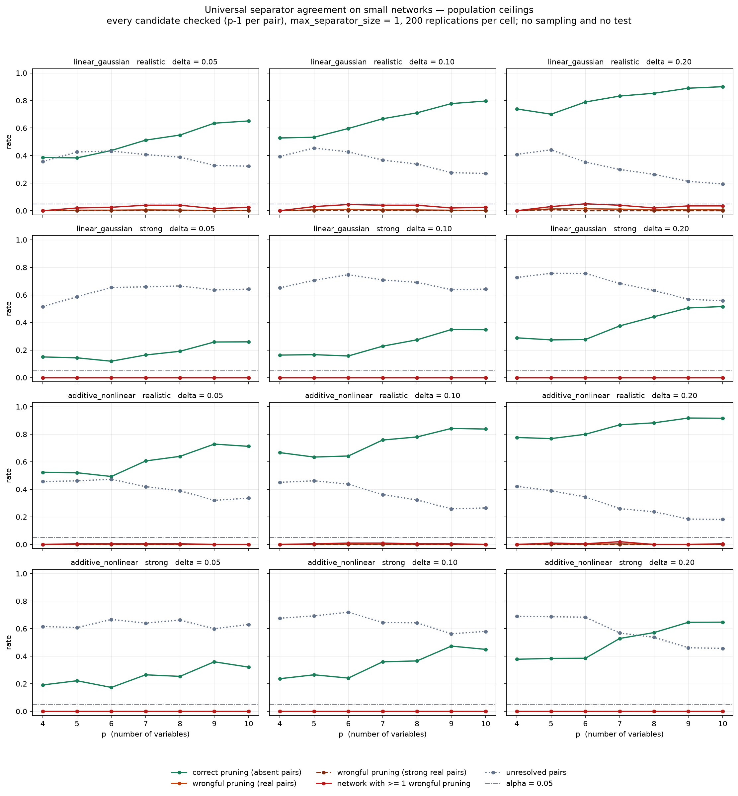

# Small-network feasibility, Phase A — universal agreement gets *worse* as p falls

The [p=15 feasibility gate](../separator-agreement-feasibility/README.md) found that universal
agreement over the candidate pool removes the population failure the comparator gate exposed.
`p = 15` is not the intended use. This runs the same rule at `p = 4 .. 10`.

**Headline: performance degrades as the network shrinks, and the degradation is entirely in
usefulness, not in safety.** Correct pruning falls steadily from `p = 10` down to `p = 4` in
every one of the twelve conditions; unresolved pairs rise to match; wrongful pruning stays at
or near zero throughout, and wrongful pruning of *strong* real pairs is zero in 83 of 84 cells.
Small networks do not break the rule. They make it quiet — it stops saying anything.

## What was run

Oracle only. `linear_gaussian` uses the exact population covariance. `additive_nonlinear` uses
one 400,000-row auxiliary sample per graph with a degree-3 polynomial basis, which contains
every edge transform the generator produces. Both are population quantities. 200 replications
per cell, 5,600 graphs, `max_separator_size = 1`.

**Universal rule only.** For each pair every candidate is checked — the empty set plus each of
the other `p-2` variables, so `p - 1` checks per pair. There is no ranking and no top-`k`; the
section 15.4 selection step does not exist here.

Rates are ceilings describing infinite data. A finite-sample rule must also clear a calibrated
test, which is strictly more conservative, so real rates fall further. **No existing
calibration transfers**: under this rule the decision is the maximum of `2(p-1)` dependent
one-sided tests per pair — 6 at `p=4`, 18 at `p=10` — against the maximum of 2 the packaged
profiles were validated for.

### Graphs that can measure both errors

A graph with no nonedges cannot measure correct pruning and one with no real edges cannot
measure wrongful pruning. At `p=4` the degree cap alone permits a complete graph, so every
draw is rejected unless it has at least 2 real edges and at least 2 genuine nonedges. Rejection
was rare: 0.142 redraws per graph on average, 11 at worst.

### Monte Carlo accuracy

Measured by running the sample oracle on `linear_gaussian` graphs, where the exact answer is
also available:

| p | comparisons | mean absolute error | p95 | max |
|---|---|---|---|---|
| 4 | 720 | 0.00064 | 0.0021 | 0.0038 |
| 7 | 5,040 | 0.00049 | 0.0016 | 0.0035 |
| 10 | 16,200 | 0.00046 | 0.0015 | 0.0039 |

The worst error is 8% of the finest `delta` tested, so a pair sitting within 0.004 of the
threshold could be classified either way. That affects individual pairs, not the aggregate
rates below.

## What changes when a network has fewer variables

Three things move at once, and they do not all push the same way.

**There are fewer things to condition on.** With `p` variables a pair has `p-1` candidates to
try — 3 at `p=4`, 9 at `p=10`. Fewer chances to find a conditioning set that breaks the link.

**The networks get denser.** The degree cap of 3 is a cap per *variable*, so at `p=4` three
connections already saturates a node. Realised edge density runs 0.57 at `p=4` against 0.26 at
`p=10` — small networks under this generator are more than twice as densely connected.

**One variable is rarely enough to break a link.** This is the binding constraint. With
`max_separator_size = 1`, a pair can only be certified when a *single* variable, or nothing at
all, severs every route between them. In a dense small network two variables are typically
joined by several routes at once, so no single variable cuts them all, and the pair falls into
the unresolved state rather than being certified.

The first and third of these are what drives the result. The rule stays correct — it refuses to
delete real connections — but it increasingly refuses to say anything at all.

**A caution on the familywise column.** It improves as `p` falls partly for a mechanical
reason: a `p=4` network has 6 pairs and a `p=10` network has 45, so there are fewer chances to
make an error. Read it alongside the per-pair wrongful rate, not instead of it.

## Full sweep

| family | regime | delta | p | checks/pair | correct prune | wrongful prune | wrongful, strong | network has >=1 wrongful | unresolved | edge density | s/graph |
|---|---|---|---|---|---|---|---|---|---|---|---|
| additive_nonlinear | realistic | 0.05 | 4 | 3 | 0.524 | 0.000 | 0.000 | 0.000 | 0.457 | 0.572 | 3.68 |
| additive_nonlinear | realistic | 0.05 | 5 | 4 | 0.521 | 0.001 | 0.000 | 0.005 | 0.462 | 0.549 | 7.14 |
| additive_nonlinear | realistic | 0.05 | 6 | 5 | 0.493 | 0.001 | 0.000 | 0.005 | 0.473 | 0.469 | 11.45 |
| additive_nonlinear | realistic | 0.05 | 7 | 6 | 0.606 | 0.001 | 0.000 | 0.005 | 0.420 | 0.383 | 17.28 |
| additive_nonlinear | realistic | 0.05 | 8 | 7 | 0.639 | 0.001 | 0.000 | 0.005 | 0.390 | 0.337 | 23.96 |
| additive_nonlinear | realistic | 0.05 | 9 | 8 | 0.728 | 0.000 | 0.000 | 0.000 | 0.320 | 0.276 | 32.99 |
| additive_nonlinear | realistic | 0.05 | 10 | 9 | 0.712 | 0.000 | 0.000 | 0.000 | 0.336 | 0.266 | 44.28 |
| additive_nonlinear | realistic | 0.10 | 4 | 3 | 0.667 | 0.000 | 0.000 | 0.000 | 0.451 | 0.572 | 3.68 |
| additive_nonlinear | realistic | 0.10 | 5 | 4 | 0.634 | 0.001 | 0.000 | 0.005 | 0.462 | 0.549 | 7.14 |
| additive_nonlinear | realistic | 0.10 | 6 | 5 | 0.642 | 0.002 | 0.000 | 0.010 | 0.438 | 0.469 | 11.45 |
| additive_nonlinear | realistic | 0.10 | 7 | 6 | 0.758 | 0.001 | 0.000 | 0.010 | 0.362 | 0.383 | 17.28 |
| additive_nonlinear | realistic | 0.10 | 8 | 7 | 0.780 | 0.001 | 0.000 | 0.005 | 0.323 | 0.337 | 23.96 |
| additive_nonlinear | realistic | 0.10 | 9 | 8 | 0.842 | 0.001 | 0.000 | 0.005 | 0.258 | 0.276 | 32.99 |
| additive_nonlinear | realistic | 0.10 | 10 | 9 | 0.838 | 0.000 | 0.000 | 0.000 | 0.265 | 0.266 | 44.28 |
| additive_nonlinear | realistic | 0.20 | 4 | 3 | 0.776 | 0.000 | 0.000 | 0.000 | 0.422 | 0.572 | 3.68 |
| additive_nonlinear | realistic | 0.20 | 5 | 4 | 0.768 | 0.003 | 0.000 | 0.010 | 0.390 | 0.549 | 7.14 |
| additive_nonlinear | realistic | 0.20 | 6 | 5 | 0.800 | 0.001 | 0.000 | 0.005 | 0.345 | 0.469 | 11.45 |
| additive_nonlinear | realistic | 0.20 | 7 | 6 | 0.868 | 0.005 | 0.000 | 0.020 | 0.260 | 0.383 | 17.28 |
| additive_nonlinear | realistic | 0.20 | 8 | 7 | 0.883 | 0.000 | 0.000 | 0.000 | 0.237 | 0.337 | 23.96 |
| additive_nonlinear | realistic | 0.20 | 9 | 8 | 0.917 | 0.000 | 0.000 | 0.000 | 0.184 | 0.276 | 32.99 |
| additive_nonlinear | realistic | 0.20 | 10 | 9 | 0.916 | 0.001 | 0.000 | 0.005 | 0.182 | 0.266 | 44.28 |
| additive_nonlinear | strong | 0.05 | 4 | 3 | 0.191 | 0.000 | 0.000 | 0.000 | 0.616 | 0.588 | 3.53 |
| additive_nonlinear | strong | 0.05 | 5 | 4 | 0.222 | 0.000 | 0.000 | 0.000 | 0.608 | 0.528 | 6.76 |
| additive_nonlinear | strong | 0.05 | 6 | 5 | 0.173 | 0.000 | 0.000 | 0.000 | 0.667 | 0.448 | 10.67 |
| additive_nonlinear | strong | 0.05 | 7 | 6 | 0.265 | 0.000 | 0.000 | 0.000 | 0.640 | 0.364 | 15.86 |
| additive_nonlinear | strong | 0.05 | 8 | 7 | 0.254 | 0.000 | 0.000 | 0.000 | 0.662 | 0.330 | 22.49 |
| additive_nonlinear | strong | 0.05 | 9 | 8 | 0.359 | 0.000 | 0.000 | 0.000 | 0.599 | 0.276 | 31.30 |
| additive_nonlinear | strong | 0.05 | 10 | 9 | 0.321 | 0.000 | 0.000 | 0.000 | 0.630 | 0.254 | 41.82 |
| additive_nonlinear | strong | 0.10 | 4 | 3 | 0.237 | 0.000 | 0.000 | 0.000 | 0.676 | 0.588 | 3.53 |
| additive_nonlinear | strong | 0.10 | 5 | 4 | 0.265 | 0.000 | 0.000 | 0.000 | 0.693 | 0.528 | 6.76 |
| additive_nonlinear | strong | 0.10 | 6 | 5 | 0.241 | 0.000 | 0.000 | 0.000 | 0.719 | 0.448 | 10.67 |
| additive_nonlinear | strong | 0.10 | 7 | 6 | 0.359 | 0.000 | 0.000 | 0.000 | 0.645 | 0.364 | 15.86 |
| additive_nonlinear | strong | 0.10 | 8 | 7 | 0.366 | 0.000 | 0.000 | 0.000 | 0.642 | 0.330 | 22.49 |
| additive_nonlinear | strong | 0.10 | 9 | 8 | 0.473 | 0.000 | 0.000 | 0.000 | 0.563 | 0.276 | 31.30 |
| additive_nonlinear | strong | 0.10 | 10 | 9 | 0.450 | 0.000 | 0.000 | 0.000 | 0.580 | 0.254 | 41.82 |
| additive_nonlinear | strong | 0.20 | 4 | 3 | 0.378 | 0.000 | 0.000 | 0.000 | 0.689 | 0.588 | 3.53 |
| additive_nonlinear | strong | 0.20 | 5 | 4 | 0.384 | 0.000 | 0.000 | 0.000 | 0.686 | 0.528 | 6.76 |
| additive_nonlinear | strong | 0.20 | 6 | 5 | 0.385 | 0.000 | 0.000 | 0.000 | 0.683 | 0.448 | 10.67 |
| additive_nonlinear | strong | 0.20 | 7 | 6 | 0.529 | 0.000 | 0.000 | 0.000 | 0.568 | 0.364 | 15.86 |
| additive_nonlinear | strong | 0.20 | 8 | 7 | 0.572 | 0.000 | 0.000 | 0.000 | 0.537 | 0.330 | 22.49 |
| additive_nonlinear | strong | 0.20 | 9 | 8 | 0.646 | 0.000 | 0.000 | 0.000 | 0.461 | 0.276 | 31.30 |
| additive_nonlinear | strong | 0.20 | 10 | 9 | 0.647 | 0.000 | 0.000 | 0.000 | 0.457 | 0.254 | 41.82 |
| linear_gaussian | realistic | 0.05 | 4 | 3 | 0.387 | 0.000 | 0.000 | 0.000 | 0.357 | 0.579 | 0.02 |
| linear_gaussian | realistic | 0.05 | 5 | 4 | 0.384 | 0.004 | 0.000 | 0.020 | 0.426 | 0.541 | 0.02 |
| linear_gaussian | realistic | 0.05 | 6 | 5 | 0.437 | 0.004 | 0.000 | 0.025 | 0.433 | 0.453 | 0.03 |
| linear_gaussian | realistic | 0.05 | 7 | 6 | 0.512 | 0.006 | 0.000 | 0.040 | 0.407 | 0.388 | 0.04 |
| linear_gaussian | realistic | 0.05 | 8 | 7 | 0.549 | 0.004 | 0.000 | 0.040 | 0.389 | 0.337 | 0.05 |
| linear_gaussian | realistic | 0.05 | 9 | 8 | 0.635 | 0.002 | 0.000 | 0.015 | 0.329 | 0.278 | 0.06 |
| linear_gaussian | realistic | 0.05 | 10 | 9 | 0.651 | 0.002 | 0.000 | 0.025 | 0.323 | 0.268 | 0.09 |
| linear_gaussian | realistic | 0.10 | 4 | 3 | 0.528 | 0.000 | 0.000 | 0.000 | 0.393 | 0.579 | 0.02 |
| linear_gaussian | realistic | 0.10 | 5 | 4 | 0.533 | 0.006 | 0.000 | 0.030 | 0.455 | 0.541 | 0.02 |
| linear_gaussian | realistic | 0.10 | 6 | 5 | 0.597 | 0.009 | 0.000 | 0.045 | 0.427 | 0.453 | 0.03 |
| linear_gaussian | realistic | 0.10 | 7 | 6 | 0.668 | 0.007 | 0.000 | 0.040 | 0.367 | 0.388 | 0.04 |
| linear_gaussian | realistic | 0.10 | 8 | 7 | 0.711 | 0.006 | 0.000 | 0.040 | 0.339 | 0.337 | 0.05 |
| linear_gaussian | realistic | 0.10 | 9 | 8 | 0.778 | 0.003 | 0.000 | 0.020 | 0.276 | 0.278 | 0.06 |
| linear_gaussian | realistic | 0.10 | 10 | 9 | 0.796 | 0.003 | 0.000 | 0.025 | 0.271 | 0.268 | 0.09 |
| linear_gaussian | realistic | 0.20 | 4 | 3 | 0.739 | 0.000 | 0.000 | 0.000 | 0.409 | 0.579 | 0.02 |
| linear_gaussian | realistic | 0.20 | 5 | 4 | 0.701 | 0.013 | 0.007 | 0.030 | 0.442 | 0.541 | 0.02 |
| linear_gaussian | realistic | 0.20 | 6 | 5 | 0.789 | 0.014 | 0.000 | 0.050 | 0.353 | 0.453 | 0.03 |
| linear_gaussian | realistic | 0.20 | 7 | 6 | 0.832 | 0.011 | 0.000 | 0.040 | 0.299 | 0.388 | 0.04 |
| linear_gaussian | realistic | 0.20 | 8 | 7 | 0.853 | 0.006 | 0.000 | 0.020 | 0.264 | 0.337 | 0.05 |
| linear_gaussian | realistic | 0.20 | 9 | 8 | 0.889 | 0.008 | 0.000 | 0.035 | 0.213 | 0.278 | 0.06 |
| linear_gaussian | realistic | 0.20 | 10 | 9 | 0.900 | 0.005 | 0.000 | 0.035 | 0.194 | 0.268 | 0.09 |
| linear_gaussian | strong | 0.05 | 4 | 3 | 0.150 | 0.000 | 0.000 | 0.000 | 0.514 | 0.579 | 0.03 |
| linear_gaussian | strong | 0.05 | 5 | 4 | 0.143 | 0.000 | 0.000 | 0.000 | 0.588 | 0.525 | 0.02 |
| linear_gaussian | strong | 0.05 | 6 | 5 | 0.119 | 0.000 | 0.000 | 0.000 | 0.654 | 0.446 | 0.03 |
| linear_gaussian | strong | 0.05 | 7 | 6 | 0.164 | 0.000 | 0.000 | 0.000 | 0.659 | 0.370 | 0.04 |
| linear_gaussian | strong | 0.05 | 8 | 7 | 0.191 | 0.000 | 0.000 | 0.000 | 0.665 | 0.319 | 0.06 |
| linear_gaussian | strong | 0.05 | 9 | 8 | 0.258 | 0.000 | 0.000 | 0.000 | 0.636 | 0.269 | 0.06 |
| linear_gaussian | strong | 0.05 | 10 | 9 | 0.259 | 0.000 | 0.000 | 0.000 | 0.642 | 0.254 | 0.08 |
| linear_gaussian | strong | 0.10 | 4 | 3 | 0.163 | 0.000 | 0.000 | 0.000 | 0.652 | 0.579 | 0.03 |
| linear_gaussian | strong | 0.10 | 5 | 4 | 0.166 | 0.000 | 0.000 | 0.000 | 0.706 | 0.525 | 0.02 |
| linear_gaussian | strong | 0.10 | 6 | 5 | 0.157 | 0.000 | 0.000 | 0.000 | 0.747 | 0.446 | 0.03 |
| linear_gaussian | strong | 0.10 | 7 | 6 | 0.228 | 0.000 | 0.000 | 0.000 | 0.709 | 0.370 | 0.04 |
| linear_gaussian | strong | 0.10 | 8 | 7 | 0.274 | 0.000 | 0.000 | 0.000 | 0.691 | 0.319 | 0.06 |
| linear_gaussian | strong | 0.10 | 9 | 8 | 0.348 | 0.000 | 0.000 | 0.000 | 0.638 | 0.269 | 0.06 |
| linear_gaussian | strong | 0.10 | 10 | 9 | 0.348 | 0.000 | 0.000 | 0.000 | 0.642 | 0.254 | 0.08 |
| linear_gaussian | strong | 0.20 | 4 | 3 | 0.288 | 0.000 | 0.000 | 0.000 | 0.727 | 0.579 | 0.03 |
| linear_gaussian | strong | 0.20 | 5 | 4 | 0.274 | 0.000 | 0.000 | 0.000 | 0.757 | 0.525 | 0.02 |
| linear_gaussian | strong | 0.20 | 6 | 5 | 0.276 | 0.000 | 0.000 | 0.000 | 0.756 | 0.446 | 0.03 |
| linear_gaussian | strong | 0.20 | 7 | 6 | 0.375 | 0.000 | 0.000 | 0.000 | 0.683 | 0.370 | 0.04 |
| linear_gaussian | strong | 0.20 | 8 | 7 | 0.442 | 0.000 | 0.000 | 0.000 | 0.633 | 0.319 | 0.06 |
| linear_gaussian | strong | 0.20 | 9 | 8 | 0.505 | 0.000 | 0.000 | 0.000 | 0.568 | 0.269 | 0.06 |
| linear_gaussian | strong | 0.20 | 10 | 9 | 0.516 | 0.000 | 0.000 | 0.000 | 0.558 | 0.254 | 0.08 |



## Correct pruning by p — the whole finding in one block

| family | regime | delta | p=4 | p=5 | p=6 | p=7 | p=8 | p=9 | p=10 |
|---|---|---|---|---|---|---|---|---|---|
| additive_nonlinear | realistic | 0.05 | 0.524 | 0.521 | 0.493 | 0.606 | 0.639 | 0.728 | 0.712 |
| additive_nonlinear | realistic | 0.10 | 0.667 | 0.634 | 0.642 | 0.758 | 0.780 | 0.842 | 0.838 |
| additive_nonlinear | realistic | 0.20 | 0.776 | 0.768 | 0.800 | 0.868 | 0.883 | 0.917 | 0.916 |
| additive_nonlinear | strong | 0.05 | 0.191 | 0.222 | 0.173 | 0.265 | 0.254 | 0.359 | 0.321 |
| additive_nonlinear | strong | 0.10 | 0.237 | 0.265 | 0.241 | 0.359 | 0.366 | 0.473 | 0.450 |
| additive_nonlinear | strong | 0.20 | 0.378 | 0.384 | 0.385 | 0.529 | 0.572 | 0.646 | 0.647 |
| linear_gaussian | realistic | 0.05 | 0.387 | 0.384 | 0.437 | 0.512 | 0.549 | 0.635 | 0.651 |
| linear_gaussian | realistic | 0.10 | 0.528 | 0.533 | 0.597 | 0.668 | 0.711 | 0.778 | 0.796 |
| linear_gaussian | realistic | 0.20 | 0.739 | 0.701 | 0.789 | 0.832 | 0.853 | 0.889 | 0.900 |
| linear_gaussian | strong | 0.05 | 0.150 | 0.143 | 0.119 | 0.164 | 0.191 | 0.258 | 0.259 |
| linear_gaussian | strong | 0.10 | 0.163 | 0.166 | 0.157 | 0.228 | 0.274 | 0.348 | 0.348 |
| linear_gaussian | strong | 0.20 | 0.288 | 0.274 | 0.276 | 0.375 | 0.442 | 0.505 | 0.516 |

Twelve conditions, twelve declines. Nothing improves at small `p`.

## Safety holds throughout

Worst value observed across all seven network sizes:

| family | regime | delta | worst wrongful prune | worst wrongful, strong | worst familywise |
|---|---|---|---|---|---|
| additive_nonlinear | realistic | 0.05-0.20 | 0.005 | 0.000 | 0.020 |
| additive_nonlinear | strong | 0.05-0.20 | 0.000 | 0.000 | 0.000 |
| linear_gaussian | realistic | 0.05-0.20 | 0.014 | 0.007 | 0.050 |
| linear_gaussian | strong | 0.05-0.20 | 0.000 | 0.000 | 0.000 |

Familywise never exceeds 0.050. Wrongful pruning of strong real pairs is 0.000 in every cell
except `linear_gaussian` / `realistic` / `delta = 0.20` / `p = 5`, where it is 0.007.

## Where the rule still works at small p, and where it does not

**Usable at every size tested.** The `realistic` regime at `delta = 0.20` holds 0.74-0.92
correct pruning from `p=4` up, with wrongful pruning at or below 0.014. `delta = 0.10` in the
same regime holds 0.53-0.84. These are population ceilings, but they have room to absorb a
finite-sample loss.

**Already dead before sampling enters.** The `strong` regime at `delta = 0.05` peaks at 0.36
correct pruning with infinite data and sits at 0.12-0.22 for `p <= 6`, with 60-67% of pairs
unresolved. Finite-sample estimation can only lower that. No sample size rescues it and no
expensive study is needed to establish that.

## Limitations

* **Density is confounded with p.** The degree cap of 3 is held fixed, so small networks come
  out denser. Whether the decline is caused by having fewer variables or by the density that
  the fixed cap induces at small `p` is not separated here. Real psychological networks at
  `p=5` are typically dense, so the confounded version is arguably the relevant one, but it is
  a confound and a density-matched sweep would settle it.
* **`max_separator_size = 1`**, matching the calibrated configuration. This is the binding
  constraint on correct pruning at small `p`, and allowing size-2 separators is the obvious
  thing to test next — at `p <= 10` the combinatorial cost is small, unlike at `p = 15`.
* **Ceilings, not predictions.** No statement here bounds a finite-sample rate.
* **200 replications**, so a familywise rate of 0.050 carries a 95% upper bound near 0.085.
* **One degree cap and one generator.** Both inherited from the p=15 study for comparability.

## Reproduce

```bash
python docs/evidence/phase1/small-network-feasibility/small_network_sweep.py --workers 16
```

Roughly 45 minutes on 20 cores; `linear_gaussian` is nearly free and the cost is almost
entirely the `additive_nonlinear` Monte Carlo oracle.
